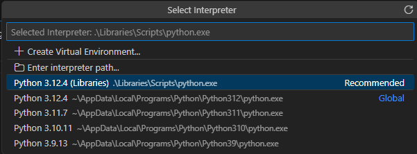
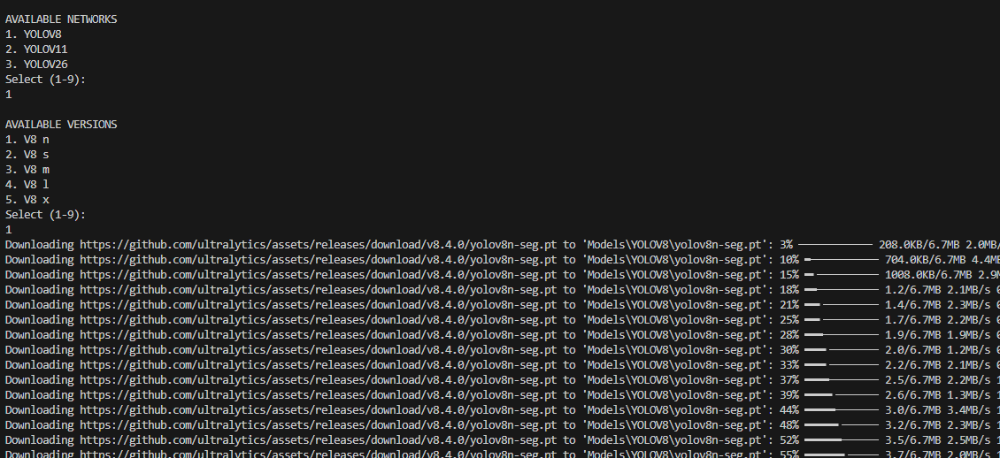
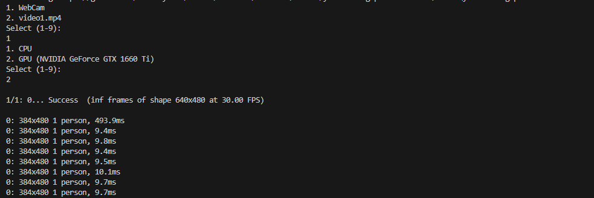
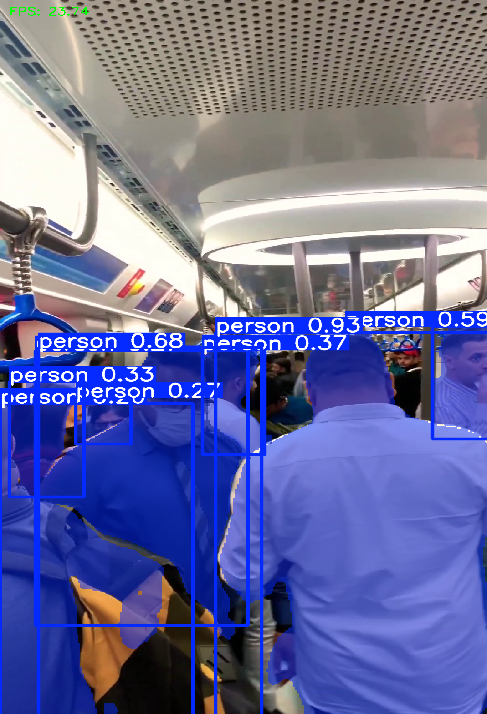
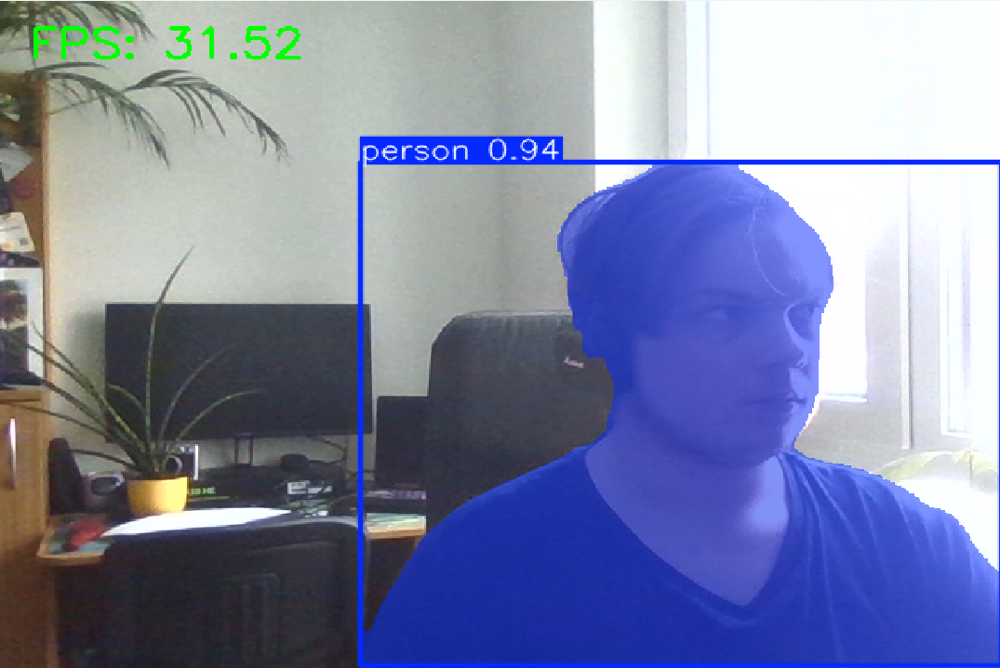

# YoloSegmentation
Yolo segmentation network launch

# Preparation for launch
For first time use launch createVirtual in cmd. This will create virtual environment "Libraries" and install torch with GPU and ultralytics packages. Next time when launching project use startVirtual to activate environment. without Virtual environment you cannot launch project. 

ideos/Images are placed in "Inputs" folder

# Launching project
To stop program press "Q" key
To launch project: 
- Select Python interpreter: 

- In cmd type startVirtual if it is not started already. 
- Launch main.py
- In terminal choose which network you want, what version. Models will be downloaded in Models/YOLOVx/ folders if you don't have it:

- Then if you can select which video to use or use webcam and to use CPU or GPU (this option is available if there is NVIDIA GPU): 

If everything is good in terminal you should see every frame information and in new window segmented persons should apear with FPS counter: 

